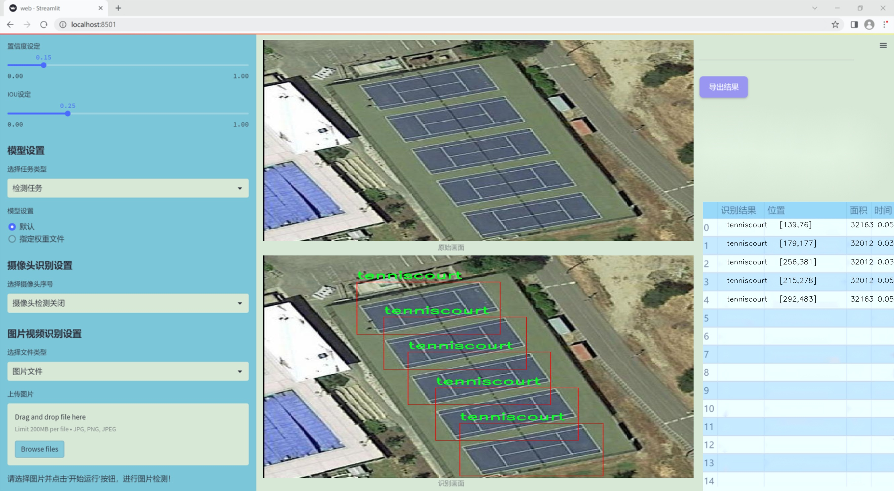
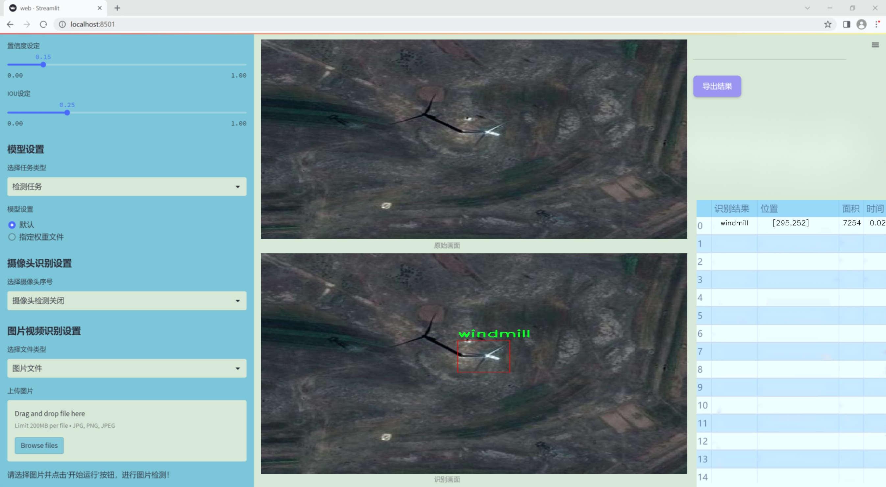
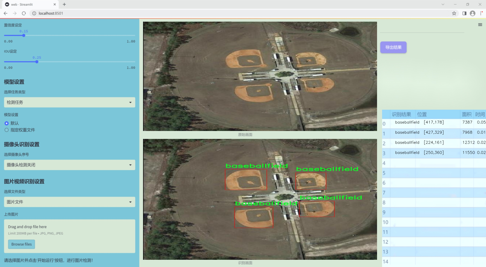
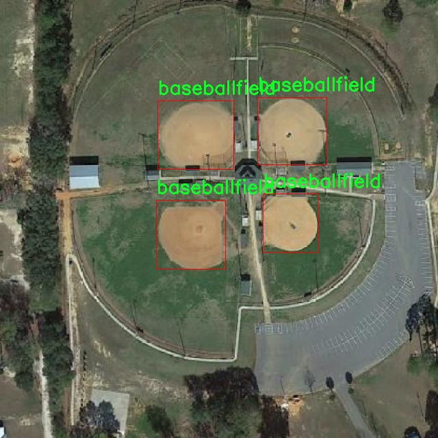
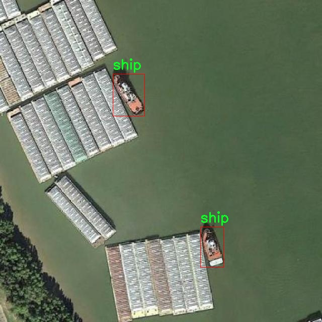
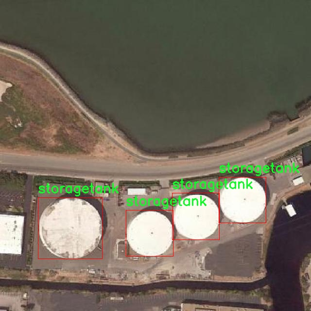
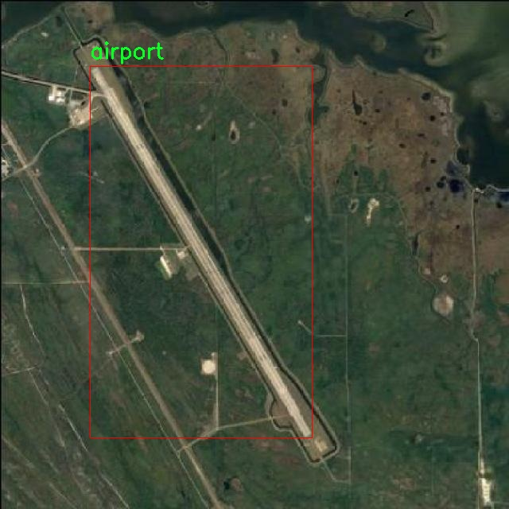
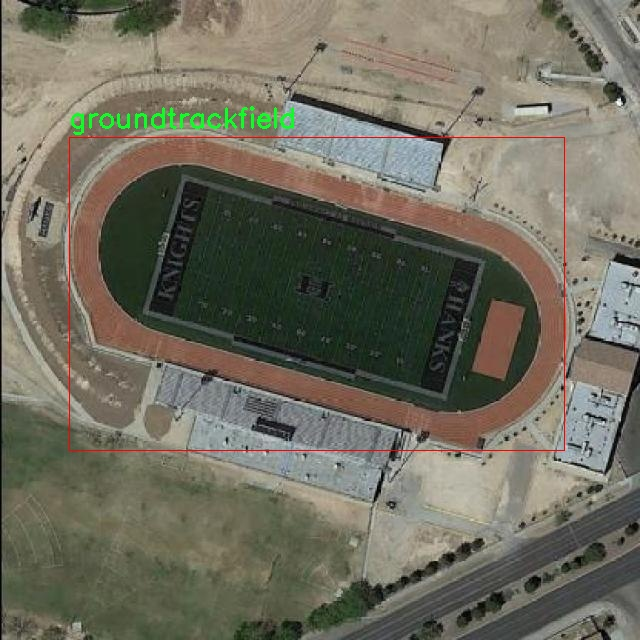

# 改进yolo11-DRBNCSPELAN等200+全套创新点大全：航拍交通设施与交通工具检测系统源码＆数据集全套

### 1.图片效果展示







##### 项目来源 **[人工智能促进会 2024.11.01](https://kdocs.cn/l/cszuIiCKVNis)**

注意：由于项目一直在更新迭代，上面“1.图片效果展示”和“2.视频效果展示”展示的系统图片或者视频可能为老版本，新版本在老版本的基础上升级如下：（实际效果以升级的新版本为准）

  （1）适配了YOLOV11的“目标检测”模型和“实例分割”模型，通过加载相应的权重（.pt）文件即可自适应加载模型。

  （2）支持“图片识别”、“视频识别”、“摄像头实时识别”三种识别模式。

  （3）支持“图片识别”、“视频识别”、“摄像头实时识别”三种识别结果保存导出，解决手动导出（容易卡顿出现爆内存）存在的问题，识别完自动保存结果并导出到tempDir中。

  （4）支持Web前端系统中的标题、背景图等自定义修改。

  另外本项目提供训练的数据集和训练教程,暂不提供权重文件（best.pt）,需要您按照教程进行训练后实现图片演示和Web前端界面演示的效果。

### 2.视频效果展示

[2.1 视频效果展示](https://www.bilibili.com/video/BV11ySXY4E9C/)

### 3.背景

研究背景与意义

随着城市化进程的加快，交通设施与交通工具的管理与监控变得愈发重要。传统的交通监测手段往往依赖于人工巡查，效率低下且容易出现漏检和误检的问题。近年来，随着无人机技术的迅猛发展，航拍技术逐渐成为交通监测的重要手段。通过航拍，可以从空中获取更为全面和高效的交通数据，为交通管理提供科学依据。因此，基于改进YOLOv11的航拍交通设施与交通工具检测系统的研究显得尤为重要。

本项目旨在利用YOLOv11这一先进的目标检测模型，结合航拍数据，对交通设施和交通工具进行高效、准确的检测。YOLOv11作为一种实时目标检测算法，具有高效性和准确性，能够在复杂的交通环境中快速识别多种目标。我们所使用的数据集包含2200幅图像，涵盖了多种交通设施和交通工具的类别，包括高速公路服务区、收费站、飞机、机场、桥梁、船只等。这些类别的多样性为模型的训练提供了丰富的样本，有助于提升模型的泛化能力和实用性。

通过对航拍图像的深度学习分析，本研究不仅能够提高交通设施与交通工具的检测精度，还能够为城市交通管理提供实时监控和数据支持，进而推动智能交通系统的发展。此外，研究成果将为后续的交通安全评估、交通流量分析等提供基础数据，具有重要的学术价值和实际应用意义。总之，基于改进YOLOv11的航拍交通设施与交通工具检测系统的研究，不仅是对现有交通监测技术的创新和提升，也为实现智能化、数字化的交通管理提供了新的思路和方法。

### 4.数据集信息展示

##### 4.1 本项目数据集详细数据（类别数＆类别名）

nc: 20
names: ['Expressway-Service-area', 'Expressway-toll-station', 'airplane', 'airport', 'baseballfield', 'basketballcourt', 'bridge', 'chimney', 'dam', 'golffield', 'groundtrackfield', 'harbor', 'overpass', 'ship', 'stadium', 'storagetank', 'tenniscourt', 'trainstation', 'vehicle', 'windmill']


该项目为【目标检测】数据集，请在【训练教程和Web端加载模型教程（第三步）】这一步的时候按照【目标检测】部分的教程来训练

##### 4.2 本项目数据集信息介绍

本项目数据集信息介绍

本项目所使用的数据集名为“MyYoloObjectDetionWithDior”，旨在为改进YOLOv11的航拍交通设施与交通工具检测系统提供强有力的支持。该数据集包含20个类别，涵盖了多种与交通相关的设施和工具，具体类别包括：高速公路服务区、高速公路收费站、飞机、机场、棒球场、篮球场、桥梁、烟囱、大坝、高尔夫球场、跑道、港口、立交桥、船只、体育场、储罐、网球场、火车站、车辆和风车。这些类别的选择不仅考虑了交通设施的多样性，还兼顾了不同场景下交通工具的丰富性，确保了数据集的全面性和实用性。

在数据集的构建过程中，我们注重了数据的多样性和代表性，涵盖了城市、乡村、海洋和空中等多种环境，以便于模型在不同场景下的适应性训练。每个类别的样本均经过精心挑选，确保在视觉特征、尺度和角度上具有一定的变化性，从而提高模型的泛化能力。此外，数据集中的图像均为高分辨率航拍图像，提供了清晰的视角，使得目标检测的准确性得以提升。

通过使用“MyYoloObjectDetionWithDior”数据集，我们希望能够有效地训练出一个更为精准的YOLOv11模型，以便在实际应用中实现对交通设施与交通工具的高效检测。这不仅将提升交通管理的智能化水平，也为未来的智能交通系统奠定了坚实的基础。











### 5.全套项目环境部署视频教程（零基础手把手教学）

[5.1 所需软件PyCharm和Anaconda安装教程（第一步）](https://www.bilibili.com/video/BV1BoC1YCEKi/?spm_id_from=333.999.0.0&vd_source=bc9aec86d164b67a7004b996143742dc)


[5.2 安装Python虚拟环境创建和依赖库安装视频教程（第二步）](https://www.bilibili.com/video/BV1ZoC1YCEBw?spm_id_from=333.788.videopod.sections&vd_source=bc9aec86d164b67a7004b996143742dc)

### 6.改进YOLOv11训练教程和Web_UI前端加载模型教程（零基础手把手教学）

[6.1 改进YOLOv11训练教程和Web_UI前端加载模型教程（第三步）](https://www.bilibili.com/video/BV1BoC1YCEhR?spm_id_from=333.788.videopod.sections&vd_source=bc9aec86d164b67a7004b996143742dc)


按照上面的训练视频教程链接加载项目提供的数据集，运行train.py即可开始训练



     Epoch   gpu_mem       box       obj       cls    labels  img_size
     1/200     20.8G   0.01576   0.01955  0.007536        22      1280: 100%|██████████| 849/849 [14:42<00:00,  1.04s/it]
               Class     Images     Labels          P          R     mAP@.5 mAP@.5:.95: 100%|██████████| 213/213 [01:14<00:00,  2.87it/s]
                 all       3395      17314      0.994      0.957      0.0957      0.0843

     Epoch   gpu_mem       box       obj       cls    labels  img_size
     2/200     20.8G   0.01578   0.01923  0.007006        22      1280: 100%|██████████| 849/849 [14:44<00:00,  1.04s/it]
               Class     Images     Labels          P          R     mAP@.5 mAP@.5:.95: 100%|██████████| 213/213 [01:12<00:00,  2.95it/s]
                 all       3395      17314      0.996      0.956      0.0957      0.0845

     Epoch   gpu_mem       box       obj       cls    labels  img_size
     3/200     20.8G   0.01561    0.0191  0.006895        27      1280: 100%|██████████| 849/849 [10:56<00:00,  1.29it/s]
               Class     Images     Labels          P          R     mAP@.5 mAP@.5:.95: 100%|███████   | 187/213 [00:52<00:00,  4.04it/s]
                 all       3395      17314      0.996      0.957      0.0957      0.0845


###### [项目数据集下载链接](https://kdocs.cn/l/cszuIiCKVNis)

### 7.原始YOLOv11算法讲解

YOLOv11是Ultralytics推出的YOLO系列最新版本，专为实现尖端的物体检测而设计。其架构和训练方法上进行了重大改进，使之不仅具备卓越的准确性和处理速度，还在计算效率上实现了一场革命。得益于其改进的主干和颈部架构，YOLOv11在特征提取和处理复杂任务时表现更加出色。在2024年9月27日，Ultralytics通过长达九小时的在线直播发布这一新作，展示了其在计算机视觉领域的革新。

YOLOv11通过精细的架构设计和优化训练流程，在保持高精度的同时，缩减了参数量，与YOLOv8m相比减少了22%的参数，使其在COCO数据集上的平均准确度（mAP）有所提升。这种效率的提高使YOLOv11非常适合部署在各种硬件环境中，包括边缘设备、云计算平台以及支持NVIDIA GPU的系统，确保在灵活性上的优势。

该模型支持广泛的任务，从对象检测、实例分割到图像分类、姿态估计和定向对象检测（OBB），几乎覆盖了计算机视觉的所有主要挑战。其创新的C3k2和C2PSA模块提升了网络深度和注意力机制的应用，提高了特征提取的效率和效果。同时，YOLOv11的改进网络结构也使之在复杂视觉任务上得以从容应对，成为各类计算机视觉任务的多功能选择。这些特性令YOLOv11在实施实时物体检测的各个领域中表现出众。
* * *

2024年9月27日，Ultralytics在线直播长达九小时，为YOLO11召开“发布会”

YOLO11 是 Ultralytics YOLO 系列实时物体检测器的最新版本，它以尖端的准确性、速度和效率重新定义了可能性。在之前 YOLO
版本的显著进步的基础上，YOLO11 在架构和训练方法方面进行了重大改进，使其成为各种计算机视觉任务的多功能选择。


##### YOLO11主要特点：

  * 增强的特征提取：YOLO11 采用了改进的主干和颈部架构，增强了特征提取能力，可实现更精确的对象检测和复杂任务性能。
  * 针对效率和速度进行了优化：YOLO11 引入了完善的架构设计和优化的训练流程，可提供更快的处理速度，并在准确度和性能之间保持最佳平衡。
  * 更少的参数，更高的准确度：借助模型设计的进步，YOLO11m 在 COCO 数据集上实现了更高的平均准确度 (mAP)，同时使用的参数比 YOLOv8m 少 22%，从而提高了计算效率，同时又不影响准确度。
  * 跨环境的适应性：YOLO11 可以无缝部署在各种环境中，包括边缘设备、云平台和支持 NVIDIA GPU 的系统，从而确保最大的灵活性。
  * 支持的任务范围广泛：无论是对象检测、实例分割、图像分类、姿势估计还是定向对象检测 (OBB)，YOLO11 都旨在满足各种计算机视觉挑战。

##### 支持的任务和模式

YOLO11 以 YOLOv8 中引入的多功能模型系列为基础，为各种计算机视觉任务提供增强的支持：

Model| Filenames| Task| Inference| Validation| Training| Export  
---|---|---|---|---|---|---  
YOLO11| yolol11n.pt, yolol11s.pt, yolol11m.pt, yolol11x.pt| Detection| ✅| ✅|
✅| ✅  
YOLO11-seg| yolol11n-seg.pt, yolol11s-seg.pt, yolol11m-seg.pt,
yolol11x-seg.pt| Instance Segmentation| ✅| ✅| ✅| ✅  
YOLO11-pose| yolol11n-pose.pt, yolol11s-pose.pt, yolol11m-pose.pt,
yolol11x-pose.pt| Pose/Keypoints| ✅| ✅| ✅| ✅  
YOLO11-obb| yolol11n-obb.pt, yolol11s-obb.pt, yolol11m-obb.pt,
yolol11x-obb.pt| Oriented Detection| ✅| ✅| ✅| ✅  
YOLO11-cls| yolol11n-cls.pt, yolol11s-cls.pt, yolol11m-cls.pt,
yolol11x-cls.pt| Classification| ✅| ✅| ✅| ✅  
  
##### 简单的 YOLO11 训练和推理示例

以下示例适用于用于对象检测的 YOLO11 Detect 模型。

    
    
    from ultralytics import YOLO
    
    # Load a model
    model = YOLO("yolo11n.pt")
    
    # Train the model
    train_results = model.train(
        data="coco8.yaml",  # path to dataset YAML
        epochs=100,  # number of training epochs
        imgsz=640,  # training image size
        device="cpu",  # device to run on, i.e. device=0 or device=0,1,2,3 or device=cpu
    )
    
    # Evaluate model performance on the validation set
    metrics = model.val()
    
    # Perform object detection on an image
    results = model("path/to/image.jpg")
    results[0].show()
    
    # Export the model to ONNX format
    path = model.export(format="onnx")  # return path to exported model

##### 支持部署于边缘设备

YOLO11 专为适应各种环境而设计，包括边缘设备。其优化的架构和高效的处理能力使其适合部署在边缘设备、云平台和支持 NVIDIA GPU
的系统上。这种灵活性确保 YOLO11 可用于各种应用，从移动设备上的实时检测到云环境中的复杂分割任务。有关部署选项的更多详细信息，请参阅导出文档。

##### YOLOv11 yaml文件

    
    
    # Ultralytics YOLO 🚀, AGPL-3.0 license
    # YOLO11 object detection model with P3-P5 outputs. For Usage examples see https://docs.ultralytics.com/tasks/detect
    
    # Parameters
    nc: 80 # number of classes
    scales: # model compound scaling constants, i.e. 'model=yolo11n.yaml' will call yolo11.yaml with scale 'n'
      # [depth, width, max_channels]
      n: [0.50, 0.25, 1024] # summary: 319 layers, 2624080 parameters, 2624064 gradients, 6.6 GFLOPs
      s: [0.50, 0.50, 1024] # summary: 319 layers, 9458752 parameters, 9458736 gradients, 21.7 GFLOPs
      m: [0.50, 1.00, 512] # summary: 409 layers, 20114688 parameters, 20114672 gradients, 68.5 GFLOPs
      l: [1.00, 1.00, 512] # summary: 631 layers, 25372160 parameters, 25372144 gradients, 87.6 GFLOPs
      x: [1.00, 1.50, 512] # summary: 631 layers, 56966176 parameters, 56966160 gradients, 196.0 GFLOPs
    
    # YOLO11n backbone
    backbone:
      # [from, repeats, module, args]
      - [-1, 1, Conv, [64, 3, 2]] # 0-P1/2
      - [-1, 1, Conv, [128, 3, 2]] # 1-P2/4
      - [-1, 2, C3k2, [256, False, 0.25]]
      - [-1, 1, Conv, [256, 3, 2]] # 3-P3/8
      - [-1, 2, C3k2, [512, False, 0.25]]
      - [-1, 1, Conv, [512, 3, 2]] # 5-P4/16
      - [-1, 2, C3k2, [512, True]]
      - [-1, 1, Conv, [1024, 3, 2]] # 7-P5/32
      - [-1, 2, C3k2, [1024, True]]
      - [-1, 1, SPPF, [1024, 5]] # 9
      - [-1, 2, C2PSA, [1024]] # 10
    
    # YOLO11n head
    head:
      - [-1, 1, nn.Upsample, [None, 2, "nearest"]]
      - [[-1, 6], 1, Concat, [1]] # cat backbone P4
      - [-1, 2, C3k2, [512, False]] # 13
    
      - [-1, 1, nn.Upsample, [None, 2, "nearest"]]
      - [[-1, 4], 1, Concat, [1]] # cat backbone P3
      - [-1, 2, C3k2, [256, False]] # 16 (P3/8-small)
    
      - [-1, 1, Conv, [256, 3, 2]]
      - [[-1, 13], 1, Concat, [1]] # cat head P4
      - [-1, 2, C3k2, [512, False]] # 19 (P4/16-medium)
    
      - [-1, 1, Conv, [512, 3, 2]]
      - [[-1, 10], 1, Concat, [1]] # cat head P5
      - [-1, 2, C3k2, [1024, True]] # 22 (P5/32-large)
    
      - [[16, 19, 22], 1, Detect, [nc]] # Detect(P3, P4, P5)
    

**YOLO11和YOLOv8 yaml文件的区别**


##### 改进模块代码

  * C3k2 

    
    
    class C3k2(C2f):
        """Faster Implementation of CSP Bottleneck with 2 convolutions."""
    
        def __init__(self, c1, c2, n=1, c3k=False, e=0.5, g=1, shortcut=True):
            """Initializes the C3k2 module, a faster CSP Bottleneck with 2 convolutions and optional C3k blocks."""
            super().__init__(c1, c2, n, shortcut, g, e)
            self.m = nn.ModuleList(
                C3k(self.c, self.c, 2, shortcut, g) if c3k else Bottleneck(self.c, self.c, shortcut, g) for _ in range(n)
            )

C3k2，它是具有两个卷积的CSP（Partial Cross Stage）瓶颈架构的更快实现。

**类继承：**

  * `C3k2`继承自类`C2f`。这表明`C2f`很可能实现了经过修改的基本CSP结构，而`C3k2`进一步优化或修改了此结构。

**构造函数（`__init__`）：**

  * `c1`：输入通道。

  * `c2`：输出通道。

  * `n`：瓶颈层数（默认为1）。

  * `c3k`：一个布尔标志，确定是否使用`C3k`块或常规`Bottleneck`块。

  * `e`：扩展比率，控制隐藏层的宽度（默认为0.5）。

  * `g`：分组卷积的组归一化参数或组数（默认值为 1）。

  * `shortcut`：一个布尔值，用于确定是否在网络中包含快捷方式连接（默认值为 `True`）。

**初始化：**

  * `super().__init__(c1, c2, n, short-cut, g, e)` 调用父类 `C2f` 的构造函数，初始化标准 CSP 组件，如通道数、快捷方式、组等。

**模块列表（`self.m`）：**

  * `nn.ModuleList` 存储 `C3k` 或 `Bottleneck` 模块，具体取决于 `c3k` 的值。

  * 如果 `c3k` 为 `True`，它会初始化 `C3k` 模块。`C3k` 模块接收以下参数：

  * `self.c`：通道数（源自 `C2f`）。

  * `2`：这表示在 `C3k` 块内使用了两个卷积层。

  * `shortcut` 和 `g`：从 `C3k2` 构造函数传递。

  * 如果 `c3k` 为 `False`，则初始化标准 `Bottleneck` 模块。

`for _ in range(n)` 表示将创建 `n` 个这样的块。

**总结：**

  * `C3k2` 实现了 CSP 瓶颈架构，可以选择使用自定义 `C3k` 块（具有两个卷积）或标准 `Bottleneck` 块，具体取决于 `c3k` 标志。

  * C2PSA

    
    
    class C2PSA(nn.Module):
        """
        C2PSA module with attention mechanism for enhanced feature extraction and processing.
    
        This module implements a convolutional block with attention mechanisms to enhance feature extraction and processing
        capabilities. It includes a series of PSABlock modules for self-attention and feed-forward operations.
    
        Attributes:
            c (int): Number of hidden channels.
            cv1 (Conv): 1x1 convolution layer to reduce the number of input channels to 2*c.
            cv2 (Conv): 1x1 convolution layer to reduce the number of output channels to c.
            m (nn.Sequential): Sequential container of PSABlock modules for attention and feed-forward operations.
    
        Methods:
            forward: Performs a forward pass through the C2PSA module, applying attention and feed-forward operations.
    
        Notes:
            This module essentially is the same as PSA module, but refactored to allow stacking more PSABlock modules.
    
        Examples:
            >>> c2psa = C2PSA(c1=256, c2=256, n=3, e=0.5)
            >>> input_tensor = torch.randn(1, 256, 64, 64)
            >>> output_tensor = c2psa(input_tensor)
        """
    
        def __init__(self, c1, c2, n=1, e=0.5):
            """Initializes the C2PSA module with specified input/output channels, number of layers, and expansion ratio."""
            super().__init__()
            assert c1 == c2
            self.c = int(c1 * e)
            self.cv1 = Conv(c1, 2 * self.c, 1, 1)
            self.cv2 = Conv(2 * self.c, c1, 1)
    
            self.m = nn.Sequential(*(PSABlock(self.c, attn_ratio=0.5, num_heads=self.c // 64) for _ in range(n)))
    
        def forward(self, x):
            """Processes the input tensor 'x' through a series of PSA blocks and returns the transformed tensor."""
            a, b = self.cv1(x).split((self.c, self.c), dim=1)
            b = self.m(b)
            return self.cv2(torch.cat((a, b), 1))

`C2PSA` 模块是一个自定义神经网络层，带有注意力机制，用于增强特征提取和处理。

**类概述**

  * **目的：**

  * `C2PSA` 模块引入了一个卷积块，利用注意力机制来改进特征提取和处理。

  * 它使用一系列 `PSABlock` 模块，这些模块可能代表某种形式的位置自注意力 (PSA)，并且该架构旨在允许堆叠多个 `PSABlock` 层。

**构造函数（`__init__`）：**

  * **参数：**

  * `c1`：输入通道（必须等于 `c2`）。

  * `c2`：输出通道（必须等于 `c1`）。

  * `n`：要堆叠的 `PSABlock` 模块数量（默认值为 1）。

  * `e`：扩展比率，用于计算隐藏通道的数量（默认值为 0.5）。

  * **属性：**

  * `self.c`：隐藏通道数，计算为 `int(c1 * e)`。

  * `self.cv1`：一个 `1x1` 卷积，将输入通道数从 `c1` 减少到 `2 * self.c`。这为将输入分成两部分做好准备。

  * `self.cv2`：另一个 `1x1` 卷积，处理后将通道维度恢复回 `c1`。

  * `self.m`：一系列 `PSABlock` 模块。每个 `PSABlock` 接收 `self.c` 通道，注意头的数量为 `self.c // 64`。每个块应用注意和前馈操作。

**前向方法：**

  * **输入：**

  * `x`，输入张量。

  * **操作：**

  1. `self.cv1(x)` 应用 `1x1` 卷积，将输入通道大小从 `c1` 减小到 `2 * self.c`。

  2. 生成的张量沿通道维度分为两部分，`a` 和 `b`。

  * `a`：第一个 `self.c` 通道。

  * `b`：剩余的 `self.c` 通道。

  1. `b` 通过顺序容器 `self.m`，它是 `PSABlock` 模块的堆栈。这部分经过基于注意的处理。

  2. 处理后的张量 `b` 与 `a` 连接。

  3. `self.cv2` 应用 `1x1` 卷积，将通道大小恢复为 `c1`。

  * **输出：**

  * 应用注意和卷积操作后的变换后的张量。

**总结：**

  * **C2PSA** 是一个增强型卷积模块，它通过堆叠的 `PSABlock` 模块应用位置自注意力。它拆分输入张量，将注意力应用于其中一部分，然后重新组合并通过最终卷积对其进行处理。此结构有助于从输入数据中提取复杂特征。

##### 网络结构


### 8.200+种全套改进YOLOV11创新点原理讲解

#### 8.1 200+种全套改进YOLOV11创新点原理讲解大全

由于篇幅限制，每个创新点的具体原理讲解就不全部展开，具体见下列网址中的改进模块对应项目的技术原理博客网址【Blog】（创新点均为模块化搭建，原理适配YOLOv5~YOLOv11等各种版本）

[改进模块技术原理博客【Blog】网址链接](https://gitee.com/qunmasj/good)


#### 8.2 精选部分改进YOLOV11创新点原理讲解

###### 这里节选部分改进创新点展开原理讲解(完整的改进原理见上图和[改进模块技术原理博客链接](https://gitee.com/qunmasj/good)【如果此小节的图加载失败可以通过CSDN或者Github搜索该博客的标题访问原始博客，原始博客图片显示正常】


#### 特征融合

模型架构图如下

  Darknet-53的特点可以这样概括：（Conv卷积模块+Residual Block残差块）串行叠加4次

  Conv卷积层+Residual Block残差网络就被称为一个stage


上面红色指出的那个，原始的Darknet-53里面有一层 卷积，在YOLOv11里面，把一层卷积移除了

为什么移除呢？

        原始Darknet-53模型中间加的这个卷积层做了什么？滤波器（卷积核）的个数从 上一个卷积层的512个，先增加到1024个卷积核，然后下一层卷积的卷积核的个数又降低到512个

        移除掉这一层以后，少了1024个卷积核，就可以少做1024次卷积运算，同时也少了1024个3×3的卷积核的参数，也就是少了9×1024个参数需要拟合。这样可以大大减少了模型的参数，（相当于做了轻量化吧）

        移除掉这个卷积层，可能是因为作者发现移除掉这个卷积层以后，模型的score有所提升，所以才移除掉的。为什么移除掉以后，分数有所提高呢？可能是因为多了这些参数就容易，参数过多导致模型在训练集删过拟合，但是在测试集上表现很差，最终模型的分数比较低。你移除掉这个卷积层以后，参数减少了，过拟合现象不那么严重了，泛化能力增强了。当然这个是，拿着你做实验的结论，反过来再找补，再去强行解释这种现象的合理性。


通过MMdetection官方绘制册这个图我们可以看到，进来的这张图片经过一个“Feature Pyramid Network(简称FPN)”，然后最后的P3、P4、P5传递给下一层的Neck和Head去做识别任务。 PAN（Path Aggregation Network）


“FPN是自顶向下，将高层的强语义特征传递下来。PAN就是在FPN的后面添加一个自底向上的金字塔，对FPN补充，将低层的强定位特征传递上去，

FPN是自顶（小尺寸，卷积次数多得到的结果，语义信息丰富）向下（大尺寸，卷积次数少得到的结果），将高层的强语义特征传递下来，对整个金字塔进行增强，不过只增强了语义信息，对定位信息没有传递。PAN就是针对这一点，在FPN的后面添加一个自底（卷积次数少，大尺寸）向上（卷积次数多，小尺寸，语义信息丰富）的金字塔，对FPN补充，将低层的强定位特征传递上去，又被称之为“双塔战术”。

FPN层自顶向下传达强语义特征，而特征金字塔则自底向上传达强定位特征，两两联手，从不同的主干层对不同的检测层进行参数聚合,这样的操作确实很皮。
#### 自底向上增强


而 PAN（Path Aggregation Network）是对 FPN 的一种改进，它的设计理念是在 FPN 后面添加一个自底向上的金字塔。PAN 引入了路径聚合的方式，通过将浅层特征图（低分辨率但语义信息较弱）和深层特征图（高分辨率但语义信息丰富）进行聚合，并沿着特定的路径传递特征信息，将低层的强定位特征传递上去。这样的操作能够进一步增强多尺度特征的表达能力，使得 PAN 在目标检测任务中表现更加优秀。


### Gold-YOLO简介
YOLO系列模型面世至今已有8年，由于其优异的性能，已成为目标检测领域的标杆。在系列模型经过十多个不同版本的改进发展逐渐稳定完善的今天，研究人员更多关注于单个计算模块内结构的精细调整，或是head部分和训练方法上的改进。但这并不意味着现有模式已是最优解。

当前YOLO系列模型通常采用类FPN方法进行信息融合，而这一结构在融合跨层信息时存在信息损失的问题。针对这一问题，我们提出了全新的信息聚集-分发（Gather-and-Distribute Mechanism）GD机制，通过在全局视野上对不同层级的特征进行统一的聚集融合并分发注入到不同层级中，构建更加充分高效的信息交互融合机制，并基于GD机制构建了Gold-YOLO。在COCO数据集中，我们的Gold-YOLO超越了现有的YOLO系列，实现了精度-速度曲线上的SOTA。


精度和速度曲线（TensorRT7）


精度和速度曲线（TensorRT8）
传统YOLO的问题
在检测模型中，通常先经过backbone提取得到一系列不同层级的特征，FPN利用了backbone的这一特点，构建了相应的融合结构：不层级的特征包含着不同大小物体的位置信息，虽然这些特征包含的信息不同，但这些特征在相互融合后能够互相弥补彼此缺失的信息，增强每一层级信息的丰富程度，提升网络性能。

原始的FPN结构由于其层层递进的信息融合模式，使得相邻层的信息能够充分融合，但也导致了跨层信息融合存在问题：当跨层的信息进行交互融合时，由于没有直连的交互通路，只能依靠中间层充当“中介”进行融合，导致了一定的信息损失。之前的许多工作中都关注到了这一问题，而解决方案通常是通过添加shortcut增加更多的路径，以增强信息流动。

然而传统的FPN结构即便改进后，由于网络中路径过多，且交互方式不直接，基于FPN思想的信息融合结构仍然存在跨层信息交互困难和信息损失的问题。

#### Gold-YOLO：全新的信息融合交互机制


#### Gold-YOLO架构
参考该博客提出的一种全新的信息交互融合机制：信息聚集-分发机制(Gather-and-Distribute Mechanism)。该机制通过在全局上融合不同层次的特征得到全局信息，并将全局信息注入到不同层级的特征中，实现了高效的信息交互和融合。在不显著增加延迟的情况下GD机制显著增强了Neck部分的信息融合能力，提高了模型对不同大小物体的检测能力。

GD机制通过三个模块实现：信息对齐模块(FAM)、信息融合模块(IFM)和信息注入模块(Inject)。

信息对齐模块负责收集并对齐不同层级不同大小的特征

信息融合模块通过使用卷积或Transformer算子对对齐后的的特征进行融合，得到全局信息

信息注入模块将全局信息注入到不同层级中

在Gold-YOLO中，针对模型需要检测不同大小的物体的需要，并权衡精度和速度，我们构建了两个GD分支对信息进行融合：低层级信息聚集-分发分支(Low-GD)和高层级信息聚集-分发分支(High-GD)，分别基于卷积和transformer提取和融合特征信息。

此外,为了促进局部信息的流动，我们借鉴现有工作，构建了一个轻量级的邻接层融合模块，该模块在局部尺度上结合了邻近层的特征，进一步提升了模型性能。我们还引入并验证了预训练方法对YOLO模型的有效性，通过在ImageNet 1K上使用MAE方法对主干进行预训练，显著提高了模型的收敛速度和精度。


### 9.系统功能展示

图9.1.系统支持检测结果表格显示

  图9.2.系统支持置信度和IOU阈值手动调节

  图9.3.系统支持自定义加载权重文件best.pt(需要你通过步骤5中训练获得)

  图9.4.系统支持摄像头实时识别

  图9.5.系统支持图片识别

  图9.6.系统支持视频识别

  图9.7.系统支持识别结果文件自动保存

  图9.8.系统支持Excel导出检测结果数据


### 10. YOLOv11核心改进源码讲解

#### 10.1 head.py

以下是对代码中最核心部分的提取和详细中文注释：

```python
import torch
import torch.nn as nn
import torch.nn.functional as F
from ..modules import Conv, DFL, make_anchors
from .block import *

class Detect_DyHead(nn.Module):
    """YOLOv8 检测头，使用动态头进行检测模型。"""
    
    def __init__(self, nc=80, hidc=256, block_num=2, ch=()):
        """
        初始化检测层。
        
        参数:
        nc (int): 类别数量。
        hidc (int): 隐藏层通道数。
        block_num (int): 动态头块的数量。
        ch (tuple): 输入通道数。
        """
        super().__init__()
        self.nc = nc  # 类别数量
        self.nl = len(ch)  # 检测层数量
        self.reg_max = 16  # DFL通道数
        self.no = nc + self.reg_max * 4  # 每个锚点的输出数量
        self.stride = torch.zeros(self.nl)  # 在构建过程中计算的步幅
        self.conv = nn.ModuleList(nn.Sequential(Conv(x, hidc, 1)) for x in ch)  # 卷积层
        self.dyhead = nn.Sequential(*[DyHeadBlock(hidc) for _ in range(block_num)])  # 动态头块
        self.cv2 = nn.ModuleList(
            nn.Sequential(Conv(hidc, hidc // 4, 3), nn.Conv2d(hidc // 4, 4 * self.reg_max, 1)) for _ in ch
        )  # 用于回归的卷积层
        self.cv3 = nn.ModuleList(
            nn.Sequential(
                nn.Conv2d(hidc, hidc, 3),
                nn.Conv2d(hidc, self.nc, 1),
            )
            for _ in ch
        )  # 用于分类的卷积层
        self.dfl = DFL(self.reg_max) if self.reg_max > 1 else nn.Identity()  # DFL层

    def forward(self, x):
        """连接并返回预测的边界框和类别概率。"""
        for i in range(self.nl):
            x[i] = self.conv[i](x[i])  # 通过卷积层处理输入
        x = self.dyhead(x)  # 通过动态头处理特征
        shape = x[0].shape  # 获取形状 BCHW
        for i in range(self.nl):
            x[i] = torch.cat((self.cv2[i](x[i]), self.cv3[i](x[i])), 1)  # 合并回归和分类的输出

        # 训练模式下直接返回
        if self.training:
            return x

        # 推理模式下，动态锚点和步幅的计算
        self.anchors, self.strides = (x.transpose(0, 1) for x in make_anchors(x, self.stride, 0.5))
        x_cat = torch.cat([xi.view(shape[0], self.no, -1) for xi in x], 2)  # 连接所有输出
        box, cls = x_cat.split((self.reg_max * 4, self.nc), 1)  # 分割边界框和类别
        dbox = self.dfl(box)  # 通过DFL处理边界框
        y = torch.cat((dbox, cls.sigmoid()), 1)  # 返回边界框和经过sigmoid处理的类别概率
        return y

    def bias_init(self):
        """初始化检测层的偏置，警告：需要步幅可用。"""
        for a, b, s in zip(self.cv2, self.cv3, self.stride):
            a[-1].bias.data[:] = 1.0  # 边界框偏置
            b[-1].bias.data[:self.nc] = math.log(5 / self.nc / (640 / s) ** 2)  # 类别偏置

# 其他检测头类的定义（如 Detect_AFPN_P345, Detect_Efficient 等）可以类似处理，保留核心逻辑和结构。
```

### 代码分析
1. **Detect_DyHead 类**:
   - 这是 YOLOv8 检测模型的核心类，负责处理输入特征并生成预测结果。
   - 在初始化时设置了类别数量、隐藏层通道数、动态头块数量等参数。
   - `forward` 方法中，输入特征经过卷积层和动态头块处理后，生成边界框和类别概率。

2. **方法**:
   - `forward`: 处理输入特征，生成边界框和类别概率。
   - `bias_init`: 初始化模型的偏置参数，以便于训练时更快收敛。

3. **动态特性**:
   - 该类支持动态锚点生成和步幅计算，适应不同输入尺寸的特征图。

以上是对核心部分的提取和注释，其他类可以参考此结构进行相应的处理。

该文件 `head.py` 是一个实现 YOLOv8 检测头的 PyTorch 模块，包含多个类和方法，用于构建不同类型的检测头，以适应不同的检测任务。以下是对文件内容的逐步分析和说明。

首先，文件导入了一些必要的库和模块，包括 PyTorch 的神经网络模块、数学库以及自定义的卷积模块和其他组件。接着，定义了一个 `__all__` 列表，指定了该模块公开的类名。

接下来，定义了多个检测头类，主要包括 `Detect_DyHead`、`Detect_AFPN_P345`、`Detect_Efficient` 等。这些类的构造函数中，初始化了一些参数，如类别数量、隐藏通道数、检测层数等，并构建了不同的卷积层和其他组件。

例如，`Detect_DyHead` 类是 YOLOv8 的检测头，使用动态头（DyHead）进行目标检测。它的 `forward` 方法负责将输入的特征图进行处理，生成预测的边界框和类别概率。该方法首先对输入特征图进行卷积操作，然后通过动态头进行处理，最后将输出拼接成所需的格式。

`Detect_AFPN_P345` 类则实现了带有自适应特征金字塔网络（AFPN）的检测头。其 `forward` 方法类似，但使用了 AFPN 结构来处理特征图，增强了多尺度特征的融合。

`Detect_Efficient` 类则是一个高效的检测头，使用了一些轻量级的卷积操作，以提高模型的推理速度和效率。

在这些检测头类中，还实现了 `bias_init` 方法，用于初始化偏置参数，以便在训练过程中更好地收敛。每个检测头的 `forward` 方法都返回预测的边界框和类别概率，具体的输出格式根据训练和推理模式有所不同。

此外，文件中还定义了一些用于处理特定任务的类，如 `Segment_Efficient`、`Pose_LSCD` 和 `OBB_LSCD`，这些类分别用于分割、姿态估计和旋转边界框检测等任务。它们在构造函数中定义了相应的卷积层和其他必要的组件，并在 `forward` 方法中实现了特定的前向传播逻辑。

总的来说，该文件实现了 YOLOv8 模型的检测头部分，提供了多种检测头的实现，支持不同的检测任务，并通过灵活的模块化设计，便于后续的扩展和修改。每个检测头都具备动态调整特征图的能力，以适应不同的输入和任务需求。

#### 10.2 repvit.py

以下是保留的核心代码部分，并添加了详细的中文注释：

```python
import torch
import torch.nn as nn
from timm.models.layers import SqueezeExcite

def _make_divisible(v, divisor, min_value=None):
    """
    确保所有层的通道数是8的倍数
    :param v: 输入的通道数
    :param divisor: 除数，通常为8
    :param min_value: 最小值，默认为divisor
    :return: 调整后的通道数
    """
    if min_value is None:
        min_value = divisor
    new_v = max(min_value, int(v + divisor / 2) // divisor * divisor)
    # 确保向下取整不会减少超过10%
    if new_v < 0.9 * v:
        new_v += divisor
    return new_v

class Conv2d_BN(torch.nn.Sequential):
    """
    包含卷积层和批归一化层的组合
    """
    def __init__(self, in_channels, out_channels, kernel_size=1, stride=1, padding=0, dilation=1, groups=1, bn_weight_init=1):
        super().__init__()
        # 添加卷积层
        self.add_module('c', torch.nn.Conv2d(in_channels, out_channels, kernel_size, stride, padding, dilation, groups, bias=False))
        # 添加批归一化层
        self.add_module('bn', torch.nn.BatchNorm2d(out_channels))
        # 初始化批归一化层的权重
        torch.nn.init.constant_(self.bn.weight, bn_weight_init)
        torch.nn.init.constant_(self.bn.bias, 0)

    @torch.no_grad()
    def fuse_self(self):
        """
        融合卷积层和批归一化层为一个卷积层
        """
        c, bn = self._modules.values()
        # 计算新的权重和偏置
        w = bn.weight / (bn.running_var + bn.eps)**0.5
        w = c.weight * w[:, None, None, None]
        b = bn.bias - bn.running_mean * bn.weight / (bn.running_var + bn.eps)**0.5
        # 创建新的卷积层
        m = torch.nn.Conv2d(w.size(1) * self.c.groups, w.size(0), w.shape[2:], stride=self.c.stride, padding=self.c.padding, dilation=self.c.dilation, groups=self.c.groups)
        m.weight.data.copy_(w)
        m.bias.data.copy_(b)
        return m

class RepViTBlock(nn.Module):
    """
    RepViT模块，包含通道混合和token混合
    """
    def __init__(self, inp, hidden_dim, oup, kernel_size, stride, use_se, use_hs):
        super(RepViTBlock, self).__init__()
        assert stride in [1, 2]
        self.identity = stride == 1 and inp == oup
        assert(hidden_dim == 2 * inp)

        if stride == 2:
            # 对于stride为2的情况，使用卷积和SqueezeExcite
            self.token_mixer = nn.Sequential(
                Conv2d_BN(inp, inp, kernel_size, stride, (kernel_size - 1) // 2, groups=inp),
                SqueezeExcite(inp, 0.25) if use_se else nn.Identity(),
                Conv2d_BN(inp, oup, ks=1, stride=1, pad=0)
            )
            self.channel_mixer = nn.Sequential(
                Conv2d_BN(oup, 2 * oup, 1, 1, 0),
                nn.GELU() if use_hs else nn.GELU(),
                Conv2d_BN(2 * oup, oup, 1, 1, 0, bn_weight_init=0),
            )
        else:
            assert(self.identity)
            # 对于stride为1的情况，使用RepVGGDW
            self.token_mixer = nn.Sequential(
                RepVGGDW(inp),
                SqueezeExcite(inp, 0.25) if use_se else nn.Identity(),
            )
            self.channel_mixer = nn.Sequential(
                Conv2d_BN(inp, hidden_dim, 1, 1, 0),
                nn.GELU() if use_hs else nn.GELU(),
                Conv2d_BN(hidden_dim, oup, 1, 1, 0, bn_weight_init=0),
            )

    def forward(self, x):
        return self.channel_mixer(self.token_mixer(x))

class RepViT(nn.Module):
    """
    RepViT模型，构建整个网络结构
    """
    def __init__(self, cfgs):
        super(RepViT, self).__init__()
        self.cfgs = cfgs
        input_channel = self.cfgs[0][2]
        # 构建初始层
        patch_embed = torch.nn.Sequential(Conv2d_BN(3, input_channel // 2, 3, 2, 1), torch.nn.GELU(),
                           Conv2d_BN(input_channel // 2, input_channel, 3, 2, 1))
        layers = [patch_embed]
        # 构建RepViTBlock
        for k, t, c, use_se, use_hs, s in self.cfgs:
            output_channel = _make_divisible(c, 8)
            exp_size = _make_divisible(input_channel * t, 8)
            layers.append(RepViTBlock(input_channel, exp_size, output_channel, k, s, use_se, use_hs))
            input_channel = output_channel
        self.features = nn.ModuleList(layers)

    def forward(self, x):
        for f in self.features:
            x = f(x)
        return x

# 示例：构建RepViT模型
if __name__ == '__main__':
    cfgs = [
        [3, 2, 64, 1, 0, 1],
        [3, 2, 64, 0, 0, 1],
        [3, 2, 128, 0, 0, 2],
        [3, 2, 128, 1, 0, 1],
    ]
    model = RepViT(cfgs)
    inputs = torch.randn((1, 3, 640, 640))  # 随机输入
    res = model(inputs)  # 前向传播
    print(res.size())  # 输出结果的尺寸
```

### 代码说明：
1. **_make_divisible**: 确保通道数是8的倍数，通常用于深度学习模型中以提高计算效率。
2. **Conv2d_BN**: 这是一个包含卷积层和批归一化层的组合，便于模型的构建和参数初始化。
3. **RepViTBlock**: 这是RepViT模型的基本构建块，包含通道混合和token混合的操作。
4. **RepViT**: 这是整个RepViT模型的实现，负责构建网络的各个层次。
5. **示例代码**: 在主程序中，构建了一个简单的RepViT模型并进行前向传播，输出结果的尺寸。

这个程序文件 `repvit.py` 实现了一个名为 RepViT 的深度学习模型，主要用于计算机视觉任务。它基于 PyTorch 框架，并且结合了卷积神经网络（CNN）和变换器（Transformer）的优点。文件中定义了多个类和函数，构建了一个灵活的模型架构。

首先，程序导入了必要的库，包括 PyTorch 的神经网络模块、NumPy 和 timm 库中的 SqueezeExcite 层。接着，定义了一个名为 `replace_batchnorm` 的函数，用于替换模型中的 BatchNorm2d 层为 Identity 层，以便在推理时提高性能。

接下来，定义了一个 `_make_divisible` 函数，确保模型中所有层的通道数都是 8 的倍数，这在某些模型架构中是一个常见的要求。

然后，定义了一个 `Conv2d_BN` 类，继承自 `torch.nn.Sequential`，用于构建卷积层和批归一化层的组合。这个类在初始化时会创建一个卷积层和一个批归一化层，并初始化它们的权重。

接着，定义了一个 `Residual` 类，表示残差连接。这个类在前向传播时会将输入与经过某个子模块处理后的输出相加，并在训练时可以选择性地进行随机丢弃。

`RepVGGDW` 类实现了一种特定的卷积结构，结合了深度可分离卷积和残差连接。它的前向传播方法将输入通过卷积和批归一化层进行处理，并与输入相加。

`RepViTBlock` 类则是 RepViT 模型的基本构建块，包含了通道混合和令牌混合的操作。它根据步幅的不同选择不同的结构，支持使用 SqueezeExcite 和 GELU 激活函数。

`RepViT` 类是整个模型的核心，负责构建模型的各个层。它根据配置参数 `cfgs` 来创建多个 `RepViTBlock`，并在前向传播时返回特征图。

在模型的训练和推理过程中，`switch_to_deploy` 方法会被调用，用于替换模型中的 BatchNorm 层为更高效的结构。

文件中还定义了多个函数，如 `update_weight` 用于更新模型的权重，和几个用于构建不同版本 RepViT 模型的函数（如 `repvit_m0_9`, `repvit_m1_0` 等），这些函数根据不同的配置参数创建相应的模型，并可选择加载预训练权重。

最后，在 `__main__` 块中，创建了一个 `repvit_m2_3` 模型实例，并通过随机生成的输入张量进行前向传播，输出每个特征图的尺寸。这段代码展示了如何使用该模型进行推理。

整体而言，这个程序文件实现了一个灵活且高效的深度学习模型，适用于各种计算机视觉任务，具有良好的可扩展性和可配置性。

#### 10.3 test_selective_scan.py

以下是保留的核心代码部分，并附上详细的中文注释：

```python
import torch
import torch.nn.functional as F

def build_selective_scan_fn(selective_scan_cuda: object = None, mode="mamba_ssm"):
    """
    构建选择性扫描函数，使用指定的CUDA实现。
    
    参数:
    selective_scan_cuda: CUDA实现的选择性扫描函数
    mode: 模式名称，决定使用的具体实现
    
    返回:
    selective_scan_fn: 选择性扫描函数
    """
    
    class SelectiveScanFn(torch.autograd.Function):
        @staticmethod
        def forward(ctx, u, delta, A, B, C, D=None, z=None, delta_bias=None, delta_softplus=False, return_last_state=False):
            """
            前向传播函数，执行选择性扫描的计算。
            
            参数:
            ctx: 上下文对象，用于保存信息以供反向传播使用
            u: 输入张量
            delta: 变化率张量
            A, B, C: 其他输入张量
            D: 可选的张量
            z: 可选的张量
            delta_bias: 可选的偏置
            delta_softplus: 是否使用softplus激活
            return_last_state: 是否返回最后状态
            
            返回:
            out: 输出张量
            last_state: 最后状态（如果需要）
            """
            # 确保输入张量是连续的
            if u.stride(-1) != 1:
                u = u.contiguous()
            if delta.stride(-1) != 1:
                delta = delta.contiguous()
            if D is not None:
                D = D.contiguous()
            if B.stride(-1) != 1:
                B = B.contiguous()
            if C.stride(-1) != 1:
                C = C.contiguous()
            if z is not None and z.stride(-1) != 1:
                z = z.contiguous()

            # 调用CUDA实现的前向函数
            out, x, *rest = selective_scan_cuda.fwd(u, delta, A, B, C, D, z, delta_bias, delta_softplus)

            # 保存用于反向传播的张量
            ctx.save_for_backward(u, delta, A, B, C, D, delta_bias, x)
            last_state = x[:, :, -1, 1::2]  # 获取最后状态
            return out if not return_last_state else (out, last_state)

        @staticmethod
        def backward(ctx, dout):
            """
            反向传播函数，计算梯度。
            
            参数:
            ctx: 上下文对象，包含前向传播时保存的信息
            dout: 输出的梯度
            
            返回:
            du, ddelta, dA, dB, dC, dD, dz, ddelta_bias: 输入张量的梯度
            """
            # 从上下文中恢复保存的张量
            u, delta, A, B, C, D, delta_bias, x = ctx.saved_tensors
            
            # 调用CUDA实现的反向函数
            du, ddelta, dA, dB, dC, dD, ddelta_bias, *rest = selective_scan_cuda.bwd(u, delta, A, B, C, D, delta_bias, dout, x)

            return du, ddelta, dA, dB, dC, dD, ddelta_bias

    def selective_scan_fn(u, delta, A, B, C, D=None, z=None, delta_bias=None, delta_softplus=False, return_last_state=False):
        """
        封装选择性扫描函数的调用。
        
        参数:
        u, delta, A, B, C, D, z, delta_bias, delta_softplus, return_last_state: 输入参数
        
        返回:
        outs: 输出结果
        """
        outs = SelectiveScanFn.apply(u, delta, A, B, C, D, z, delta_bias, delta_softplus, return_last_state)
        return outs

    return selective_scan_fn

# 选择性扫描函数的构建
selective_scan_fn = build_selective_scan_fn(selective_scan_cuda=None, mode="mamba_ssm")

# 示例输入
u = torch.randn(2, 768, 64, requires_grad=True)
delta = torch.randn(2, 768, 64, requires_grad=True)
A = torch.randn(768, 1, requires_grad=True)
B = torch.randn(2, 1, 768, 64, requires_grad=True)
C = torch.randn(2, 1, 768, 64, requires_grad=True)

# 调用选择性扫描函数
output = selective_scan_fn(u, delta, A, B, C)
print(output)
```

### 代码说明：
1. **build_selective_scan_fn**: 该函数用于构建选择性扫描的函数，接受一个CUDA实现和模式名称作为参数。
2. **SelectiveScanFn**: 这是一个自定义的PyTorch自动求导函数，包含前向和反向传播的实现。
   - **forward**: 实现选择性扫描的前向计算，处理输入张量并调用CUDA实现。
   - **backward**: 计算梯度，调用CUDA实现的反向传播。
3. **selective_scan_fn**: 封装了`SelectiveScanFn`的调用，简化了用户的接口。
4. **示例输入**: 创建了一些随机输入张量并调用选择性扫描函数，输出结果。

通过这种方式，代码的核心逻辑得以保留，同时提供了清晰的中文注释，便于理解。

这个程序文件 `test_selective_scan.py` 主要实现了一个名为“选择性扫描”（Selective Scan）的功能，通常用于处理序列数据，尤其是在深度学习中。文件中包含了多个函数和类，利用 PyTorch 框架进行张量运算和自动求导。以下是对代码的详细说明。

首先，文件导入了一些必要的库，包括 `torch` 和 `torch.nn.functional`，以及用于测试的 `pytest`。同时，还引入了 `einops` 库用于张量的重排和复制。文件的开头定义了一个标志 `SSOFLEX_FLOAT`，可能用于控制某些操作的浮点数类型。

接下来，定义了一个函数 `build_selective_scan_fn`，它接收一个 CUDA 实现的选择性扫描函数和其他参数，返回一个自定义的 PyTorch 函数。这个函数内部定义了一个 `SelectiveScanFn` 类，继承自 `torch.autograd.Function`，用于实现前向和反向传播的逻辑。

在 `SelectiveScanFn` 类中，`forward` 方法实现了选择性扫描的前向计算。它首先确保输入张量是连续的，然后根据输入的维度进行适当的重排。接着，它根据不同的模式（如 `mamba_ssm`、`ssoflex` 等）调用相应的 CUDA 实现，计算输出结果和中间状态。该方法还支持返回最后的状态信息。

`backward` 方法实现了反向传播的逻辑，计算各个输入张量的梯度。它根据不同的模式调用相应的 CUDA 实现，处理输入张量的梯度，并返回计算得到的梯度。

接下来，定义了 `selective_scan_ref` 和 `selective_scan_ref_v2` 函数，这两个函数实现了选择性扫描的参考实现，主要用于与 CUDA 实现的结果进行比较。它们的输入参数与前面的函数相似，输出结果也相似。

然后，定义了一个 `selective_scan_fn` 函数，它是对 `selective_scan_ref_v2` 的简单封装，方便调用。

在文件的后半部分，设置了不同的模式（如 `mamba_ssm_ssoflex`），并根据模式导入相应的 CUDA 实现。最后，使用 `pytest` 定义了一个测试函数 `test_selective_scan`，该函数通过不同的参数组合对选择性扫描的实现进行测试。测试过程中，生成了随机输入数据，并调用选择性扫描函数和参考实现，比较它们的输出和梯度是否一致。

整个文件的设计旨在实现高效的选择性扫描操作，并通过测试确保实现的正确性和性能。

#### 10.4 test_selective_scan_speed.py

以下是经过简化和注释的核心代码部分，保留了主要功能并添加了详细的中文注释：

```python
import torch
import torch.nn.functional as F

def build_selective_scan_fn(selective_scan_cuda: object = None, mode="mamba_ssm"):
    """
    构建选择性扫描函数，使用指定的CUDA实现和模式。
    """
    class SelectiveScanFn(torch.autograd.Function):
        @staticmethod
        def forward(ctx, u, delta, A, B, C, D=None, z=None, delta_bias=None, delta_softplus=False, return_last_state=False):
            """
            前向传播函数，计算选择性扫描的输出。
            """
            # 确保输入张量是连续的
            u = u.contiguous()
            delta = delta.contiguous()
            if D is not None:
                D = D.contiguous()
            B = B.contiguous()
            C = C.contiguous()
            if z is not None:
                z = z.contiguous()
            
            # 进行选择性扫描的前向计算
            out, x, *rest = selective_scan_cuda.fwd(u, delta, A, B, C, D, z, delta_bias, delta_softplus)

            # 保存中间变量以供反向传播使用
            ctx.save_for_backward(u, delta, A, B, C, D, z, delta_bias, x)
            last_state = x[:, :, -1, 1::2]  # 获取最后的状态
            return out if not return_last_state else (out, last_state)

        @staticmethod
        def backward(ctx, dout):
            """
            反向传播函数，计算梯度。
            """
            # 从上下文中恢复保存的张量
            u, delta, A, B, C, D, z, delta_bias, x = ctx.saved_tensors
            
            # 计算反向传播的梯度
            du, ddelta, dA, dB, dC, dD, ddelta_bias, *rest = selective_scan_cuda.bwd(
                u, delta, A, B, C, D, z, delta_bias, dout, x, None, False
            )

            return (du, ddelta, dA, dB, dC, dD, None, ddelta_bias, None)

    def selective_scan_fn(u, delta, A, B, C, D=None, z=None, delta_bias=None, delta_softplus=False, return_last_state=False):
        """
        包装选择性扫描函数，调用自定义的前向和反向传播实现。
        """
        return SelectiveScanFn.apply(u, delta, A, B, C, D, z, delta_bias, delta_softplus, return_last_state)

    return selective_scan_fn

# 示例调用
# selective_scan = build_selective_scan_fn(selective_scan_cuda, mode="mamba_ssm")
# output = selective_scan(u, delta, A, B, C, D, z, delta_bias)
```

### 代码说明：
1. **`build_selective_scan_fn`**: 该函数用于构建选择性扫描的函数，接受一个CUDA实现和模式作为参数。
2. **`SelectiveScanFn`**: 这是一个自定义的PyTorch函数，继承自`torch.autograd.Function`，实现了前向和反向传播的逻辑。
   - **`forward`**: 计算选择性扫描的输出，处理输入的连续性，调用CUDA实现进行计算，并保存必要的中间变量以供反向传播使用。
   - **`backward`**: 计算梯度，使用保存的变量和CUDA实现的反向传播逻辑。
3. **`selective_scan_fn`**: 这是一个包装函数，调用自定义的前向和反向传播实现，简化了用户的调用过程。

### 注意事项：
- 代码中省略了许多具体的参数检查和处理逻辑，保留了核心功能以便于理解。
- 在实际使用中，需要根据具体的CUDA实现和数据格式进行适当的调整。

这个程序文件 `test_selective_scan_speed.py` 主要用于实现和测试选择性扫描（Selective Scan）算法的性能。该算法在深度学习和序列建模中有广泛应用，尤其是在处理时间序列数据时。程序的核心部分包括定义选择性扫描的前向和反向传播操作，以及对不同实现的性能进行测试。

程序首先导入了一些必要的库，包括 `torch`、`math`、`pytest` 等。接着定义了一个函数 `build_selective_scan_fn`，用于构建选择性扫描的自定义 PyTorch 函数。这个函数内部定义了一个名为 `SelectiveScanFn` 的类，继承自 `torch.autograd.Function`，实现了前向和反向传播的方法。

在 `SelectiveScanFn` 的 `forward` 方法中，首先对输入的张量进行连续性检查，并进行必要的维度调整。然后根据不同的模式（如 `mamba_ssm`、`sscore` 等）调用相应的 CUDA 实现进行前向计算。计算结果包括输出和中间状态，最后将必要的张量保存到上下文中，以便在反向传播时使用。

`backward` 方法则实现了反向传播的逻辑，计算梯度并返回。这个方法根据不同的模式调用相应的 CUDA 实现，处理输入的梯度并返回各个输入的梯度。

接下来，程序定义了几个选择性扫描的参考实现，包括 `selective_scan_ref`、`selective_scan_easy` 和 `selective_scan_easy_v2`，这些实现主要用于在不同情况下进行选择性扫描的计算。

最后，程序定义了一个 `test_speed` 函数，用于测试不同选择性扫描实现的性能。它设置了一些参数，包括数据类型、序列长度、批量大小等，并生成随机输入数据。然后，它使用时间测量来评估每种实现的前向和反向传播的速度，并输出结果。

总的来说，这个程序文件通过定义选择性扫描的前向和反向传播操作，并通过性能测试来比较不同实现的效率，旨在为深度学习模型的优化提供支持。

注意：由于此博客编辑较早，上面“10.YOLOv11核心改进源码讲解”中部分代码可能会优化升级，仅供参考学习，以“11.完整训练+Web前端界面+200+种全套创新点源码、数据集获取”的内容为准。

### 11.完整训练+Web前端界面+200+种全套创新点源码、数据集获取


# [下载链接：https://mbd.pub/o/bread/Zp6ak5Zw](https://mbd.pub/o/bread/Zp6ak5Zw)